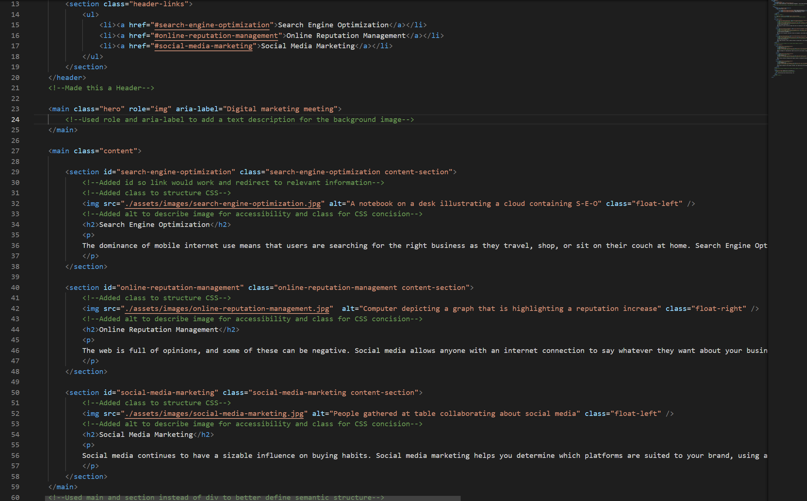

# Challenge 1

## Description

The challenge for this assignment was to refactor existing code for a mock marketing agency. The task was to make it more accessible to meet standards that will allow the website to be optimitized for search engines. 

I learned how to title a website and use the alt attribute to add image descriptions that will allow people with visual disabilities to interact with the webpage. I was able to discover that using the HTML attributes role and aria-label allowed me to add  a image description for the background image property set in the CSS file. Additionally, I utilized better HTML sectioning elements names to easily identify code structure and add classes to consolidate the CSS file.

## Installation

N/A

## Usage

To interact with this project, open the index and CSS file to view comments about changes to the code. You can also click on the links in the top right when the webpage is open in a browser.

Once the webpage is open, use Chrome DevTools by right-clicking and selecting inspect; or for windows - Control + Shift + I and for MacOS - Command + Option + I. Navigate to the arrow in the top left of the corner of the panel and select it, then hover mouse arrow over images to look at image descriptions.

[Click Here to go to the deloyed webpage.](https://afrazier01.github.io/challenge-1/)

## Credits

N/A

## License

Please refer to the LICENSE in the repo.

